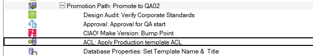

# ACL and ACL Entries

Set the ACL of the file being promoted.

!!! note
    The ACL will be set for the file (normally a template) that is being promoted. The ACL of any dataase
    linked to this template will not be affected.
    
## To Set a Database or Template ACL
1. Select the Build or Promotion Path that relates to the database or template, for which you want to set a specific ACL.
2. Click the *Create* action button and select *ACL*. The ACL document appears.
   
3. The ACL document is active by default. Leave this setting.
4. Enter a descriptive name in the *Description* field (for example, *Set Production ACL*).
5. Select a stored ACL or define your own.  
   For a stored ACL
    * Select the Store ACL option.
    * Select a stored ACL from the list
    * Click OK.
   For a defined ACL
    * Select the Define ACL here option.
    * In the Roles field, enter the roles you want to use for this database.  Enter one role per line.
    * These roles appear when you add new ACL Entry documents to your database, within Build Manager.
    * In the Administration Server field, enter the name of the target database’s administration server.
    * Enter an Administration Server Flag or select one from the list.
    * Select Enforce a consistent ACL across all replicas to ensure consistent ACLs across replicas.
    * Select the Maximum Internet name and password from the list.

Save and close the document.

It is normally a requirement that the ID being used to perform the promotion be given Manager rights to the database being promoted, otherwise when the database is promoted a second time, the promoting ID will not have rights to overwrite it.

The new ACL entry appears in the right pane, under the Build or Promotion Path to which it applies.
<figure markdown="1">
  
</figure>

## To add ACL entries: 
1. Select the ACL document under the Build or Promotion Path that relates to the database or template, for which you want to add ACL Entries.
2. Click the *Create* action button and select *ACL Entry*. The ACL Entry document appears
   
3. The ACL document is active by default. Leave this setting.
4. Use the dropdown beside the *Name* field to select a name from one or more address books. To set the default user ACL, use the text *-Default-* as the name.
5. Use the dropdown beside the *Type* field to select the ACL type specific to this entry.
6. Use the dropdown beside the *Level* field to select the ACL level specific to this entry.
   When you select a level, additional checkboxes appear, letting you specify optional and default access rights (for example, to replicate or copy documents, or to create documents.)
7. Select the roles that are specific to this entry. The available roles are those defined in the parent ACL entry.

Save and close the document.

The new ACL entry appears in the right pane, under the ACL to which it applies.

<figure markdown="1">
  
</figure>

If you create an ACL Entry action, Build Manager requires that you have a least one manager defined in the ACL entries before you can promote.
