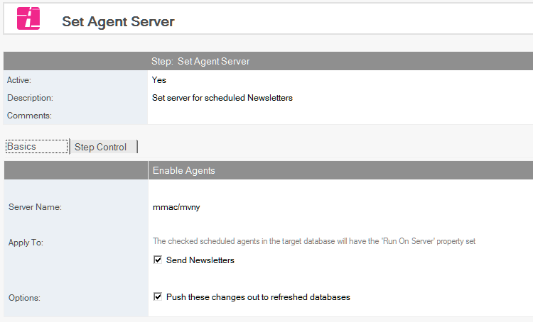
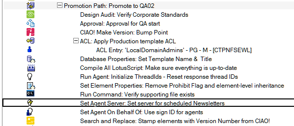

# Set Agent Server

Set the *Run On Server* property for scheduled agents.

## To Set Agent Server
1. Select the Build or Promotion Path that relates to the database or template for which you want to apply a server to its scheduled agents.
2. Click the *Create* action button and select *Set Agent Server*. The *Set Agent Server* document appears.
   
3. This document is active by default. Leave this setting.
4. Enter a descriptive name in the *Description* field (for example, Sales Server).
5. Enter the server name. Leave this field blank for a local PC. Use * for any server.
6. In the *Apply To* section, the checked scheduled or event-triggered agents in the target database have the *Run On Server* property set.

Save and close the document.

The new Set Agent Server entry appears in the right pane, under the Build or Promotion Path to which it applies. 
<figure markdown="1">
  
</figure>