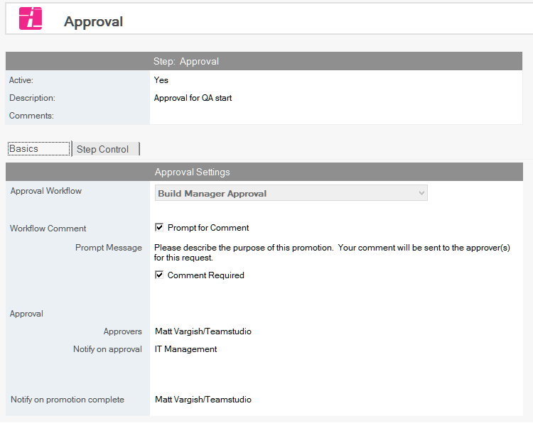
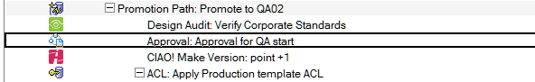

# Approvals Step

The Approval Step implements an approval workflow for any stage of the build process where a template is moved. The date and approver are logged for audit purposes.

## Configuring an Approval Step
1. Select the Promotion path document to which you want to add the Approval step.
2. Click the *Create* button and select *Approval*. The Approval document appears.
   

3. In the Approval document the Active radio button should be *Yes*. Fill in the *Description* and any required comments.
4. On the *Basics* tab the following properties can be changed.
    * *Approval Workflow* This should be set to *Build Manager Approval* from the drop down list. Approvals are the only workflows currently supported.
    * *Approvers* Authorized individuals or groups from the NAB that can perform the approval.
    * *Notify on approval* Individuals or groups from the NAB that need to know when a database has been approved so the process can continue.
    * *Notify on promotion complete* Individuals or groups from the NAB that need to know when a database has been promoted to an environment.

Save and close the document.

The new Approval entry appears in the right pane, under the Build or Promotion Path to which it applies.
<figure markdown="1">
  
</figure>

