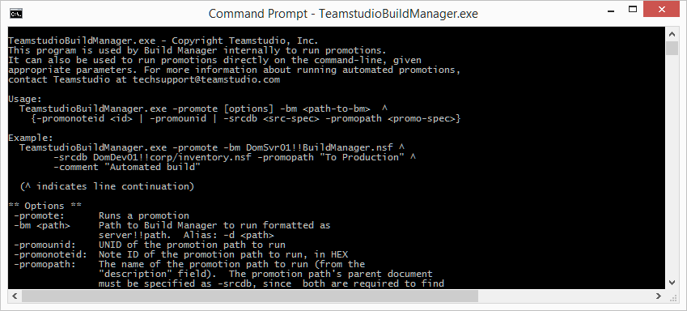

# Automating Promotions

Version 9.0 and later of Teamstudio Build Manager support running Promotions via the command-line using TeamstudioBuildManager.exe. The executable uses its return value to indicate the status of the promotion, and accepts parameters to control logging, providing an easy way to integrate Build Manager to build and deploy code as part of larger projects that employ build tools such as ANT or Continuous Integration build tools.

## Using the Executable
TeamstudioBuildManager.exe is installed in the Notes executable directory when a Notes client is first used to run a promotion. It can also be detached from the Page design element *(BMSupportingFiles)* in the Build Manager NTF. The executable must be run from the Notes executable directory of a Notes client installation on Windows.

Running the executable without any arguments will display usage information, including the parameters that can be specified.
<figure markdown="1">
  
</figure>

## Running Promotions
The minimum required parameters to run a simple promotion are the -promote command followed by parameters specifying the server and path of the Build Manager instance, and the Note ID or UNID of the promotion path to run. Invoking TeamstudioBuildManager.exe without additional arguments displays documentation for additional parameters.

!!! note
    Examples below that do not specify *-id* and *-password* will require the password of the current
    Notes ID to be entered, unless Notes is running and the security setting *Don't prompt for
    password for 3rd party Notes applications* has been enabled. For more information on using IDs,
    including requirements to run promotions that switch ID, see the Credentials section below.
    
The following example runs the promotion identified by the Note ID *B82* in the Build Manager database in the root of the server DomSrv01's data directory

``` bat
TeamstudioBuildManager.exe -promote -bm "DomSvr01!!BuildManager.nsf" -promonoteid "B82"
```
The promotion to run can alternately be identified by passing arguments identifying the source template and the promotion path. The following specifies a promotion using the Database (watch) document for the Inventory database on DomSvr01, and a child Promotion Path document with the value "To QA" as its Description.
``` bat
TeamstudioBuildManager.exe -promote -bm "DomSvr01!!BuildManager.nsf" -srcdb "DomSvr01!!dev\templates\Inventory.nsf" -promopath "To QA"
```
Note that the *-srcdb* parameter specifies a source database spec in terms of main documents in the target Build Manager. It can specify a Database document by the server and path of the database as stored in the Database document, in the form <Server>!!<Path>, or it can specify a Template Registry template in the form <TemplateRegistryName>!!<TemplateName>, where TemplateRegistryName is the name of a Stored Template Registry in the target Build Manager, and TemplateName is the name of a template in the specified Template Registry. Combined with the -promopath argument, it forms a unique key for a specific promotion.

The example below runs a promotion based on a Template Registry template, and uses several additional parameters

* Build number of the build in the Template Registry that should be used
* Comment for the build
* Notes ID used to initialize the Notes session
* Notes ID Password 
* Notes INI file to use
* File path for a log file where logging should be redirected

``` bat
TeamstudioBuildManager.exe -promote -bm "DomSvr01!!BuildManager.nsf" -srcdb "ProductionTR!!Inventory_template" -promopath "To Production" 
 -buildnum 7 -comment "Automated build" -id "c:\lotus\notes\autobuild.id" -password "buildPassword" -i "c:\lotus\notes\autobuildINI.ini" 
 -log "c:\builds\autobuild.txt"
```

## Return Value
The return code from the process returns 0 for success (the build passed) or a non-zero error code if the build fails. Errors are printed to the console (or logged in the log file, if specified), and are also recorded in the log (report) document created in the logs section of the Build Manager database.

## Logging
The output to the console (or log file if specified) is the same content that is saved in the Report (log) document stored in Build Manager (and displayed in the Build Manager status plugin, when running in the foreground).  Running command-line promotions still creates the log document in Build Manager;  the *-loglevel* parameter can be used to reduce the amount of output to the console or the log file, but does not decrease the logging saved to build Manager.

The *-l* or *-log* parameter can be used to specify a log file where output should be sent.

## Credentials
Specify the *-id* and *-password* parameters to allow the executable to initiate a Notes session and connect to the target Build Manager on server. If no credentials are specified, the executable will attempt to create the session with the current ID of the client, usually the ID specified in the Notes.ini. If the ID requires a password, the Notes API will intercept the authentication request, and prompt for the current ID's password, blocking the executable until entered. 

Promotions that specify a *Promote As* id, or use *Switch ID* steps, must provide the *-password* argument to run.

Passwords are passed on the command line as plain text.  A special single-purpose build ID can be created to run automated promotions to improve security, using the *Promote As* option for Promotion Paths to switch to appropriate Production or Signing IDs.  If the build ID and password are compromised, this ID may still have access to run promotions in Build Manager until the password is changed or the ID is replaced, However, the security risks are greatly reduced, since the build ID need not have access to production environments.

## Limitations
### UI Interactions
Command-line promotions cannot run promotions that trigger any kind of UI interaction. Currently, the following parameters can be used to prevent UI interaction

* **-comment** provides the comment for the build, and suppresses any prompt for comment that may normally be required.
* **-buildnum** specifies the Build Number for the template being extracted from a Template Registry, and suppresses any prompt to choose a build, if required.

Any other UI interaction triggered by the promotion will generally fail with typical error messages (e.g. "Product object cannot be created"), with the exception of external code, such as CIAO!, which may raise its own dialogs. This will block the promotion, for example, if a Make Version step is configured to prompt for the version information.

### Unicode
The executable, by default, prints log entries to the console in Unicode to support non-ASCII characters. This Unicode translation can be slow, and can be disabled if not required by specifying the -u parameter.

The Notes client occasionally prints directly to the output stream and can corrupt multibyte log streams. In general, the best option is to specify the -log parameter, since the log file supports Unicode and will not be corrupted by unexpected output from Notes.
