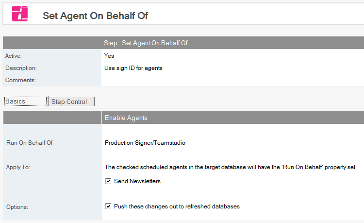
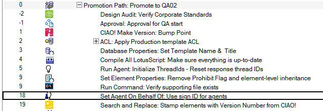

# Set Agent On Behalf Of

Set the *Run On Behalf Of* property for agents.

## To Set Agent On Behalf Of
1. Select the Build or Promotion Path that relates to the database or template for which you want to apply the setting.
2. Click the *Create* action button and select *Set Agent On Behalf Of*. The *Set Agent On Behalf Of* document appears.
   
3. This document is active by default. Leave this setting.
4. Enter a descriptive name in the *Description* field.
5. Enter the user name the agent should run as.
6. In the *Apply To* section, check the agents in the target database that should have the property set.

Save and close the document.

The new Set Agent Run On Behalf Of entry appears in the right pane, under the Build or Promotion Path to which it applies. 
<figure markdown="1">
  
</figure>