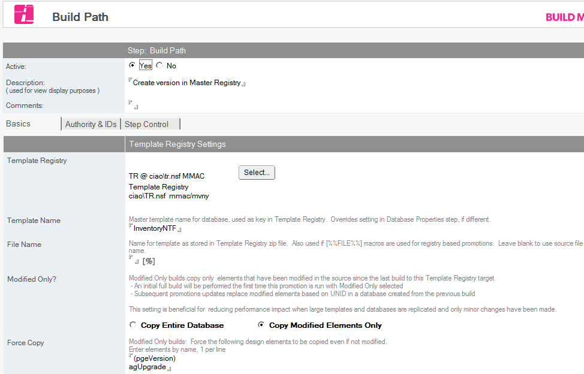

# Creating a Build Path

Build Manager can promote templates to two types of targets.

* Promotion Paths are used to promote a template to a server and file path, and are used to move templates into new environments for deployment.
* Build Paths create a build (version) of a template in a Template Registry, as part of a release control process. Templates in a Template Registry can later be deployed to environments using Promotion Paths.

This help topic covers creating a Build Path. For information on Promotion Paths, see [Creating a Promotion Path](ppcreate.md).

Build Paths specify a Template Registry where a version of an application template can be created. To configure a build path document, you create and name the build path and select the promotion options. [Build Steps](buildsteps.md) can be created as child documents for the build path, to enable additional actions on the template during the build.

## To create and name a build path
1. From the CIAO Config database, select the database document you want to create a promotion path for.
2. From the *Create* menu, click *Build Path*. You see the Build Path document.
   
3. Select *Yes* beside the *Active* field, if not already selected.
4. In the *Description* field, enter a name describing the promotion path, for example, *Dev>QA*.
This field cannot be blank and must be unique. 

## If the source is a template stored in a Template Registry
The *Registry Settings* pane is displayed. Select the *Version Options* setting that should be used to determine the build to be promoted. Optionally, configure *Deployment Tracking*. The choice of Template Registry and Template are determined by the settings of the parent Database document. 

## To configure the copy settings for the build path
You can configure the copy settings for the promotion path as follows.

1. From the *Build Path* document, select the *Basics* tab.
2. Select the Template Registry where the new template build should be created. The Registry must be defined in the Stored Resources section under Template Registries.
3. In the *Template Name* field, specify the desired name which will identify the template. This name will be used as the key to identify a particular set of template versions, and will override any value set in the source database's Template Name field.
4. In the *File Name* field, optionally specify the filename to use when storing the version. If blank, the name of the source file will be used.
5. In the *Modified Only* field, the default *Copy Entire Database* action is generally appropriate.  The *Copy Modified Elements Only* option requires careful configuration, and is only recommended in environments where remote users may need to replicate design changes over very low-bandwith connections such as cellular. For more information, see [Modify-Only Builds](modify.md)
6. Enter a Notes selection formula in the *Copy Documents* field (for example, *SELECT @ALL*) if you have documents that must stay with the database or template.
7. To create a CIAO change report in the Template Registry, select *Create CIAO! Change Report* and configure the *Change Report* fields as appropriate. CIAO must be installed and configured to watch the source database to use this feature, and the build steps must include an active Make Version step set to use the *Use Version Number* option for the CIAO label.

## To limit which users can run the build
List users who are allowed to run the build on the *Authority & IDs* tab.

## To run the build as an alternate ID
Select an ID to use on the *Authority & IDs* tab.

## To configure Build Path options
You can configure the Build options of the build path as follows

1. To prompt the person promoting the database to enter a Promotion Comment during promotion, check  *Prompt for Comments*. To require the comment, also check *Comment Required*.
2. In the *Notify on failure* field, browse to select names from one or more address books to designate who to e-mail upon failure of a promotion.  
   The promoter (the person who clicks the Promote button) is always notified with a status window at the end of the promotion.