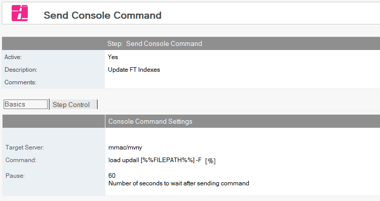

# Send Console Command

Send a remote console command to a server.

!!! note
    This step is new in Build Manager 8.0
    
## To Create a Console Command
1. Select the Promotion path document to which you want to add the Send Console Command step.
2. Click the *Create* action button and select *Send Console Command*. The *Send Console Command* document appears.
   
3. This document is active by default. Leave this setting.
4. Enter a descriptive name in the *Description* field.
5. Select the *Target Server* for the command to run on. The Promoting user must have the right to execute remote console commands on this server, or the step will fail.
6. Specify the *Command* to run. Note that the command *drop all* will end Build Manager's connection to this server and most likely fail the promotion.
7. Optionally, specify a value in seconds in the *Pause* field to have Build Manager wait for that interval before proceeding with the next step.

## Return Values
Build Manager will log the immediate output of the command to the Build Manager log. Many useful commands only return the suggestion to open a *Live Console Session* to view output, so processing the output of the remote command is of little use. If requirements dictate determining whether an operation succeeded, a [Run Agent](runagent.md) step can be used, either in lieu of this step or running after this step.