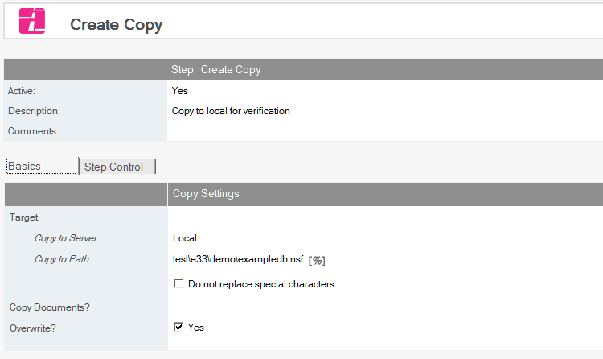
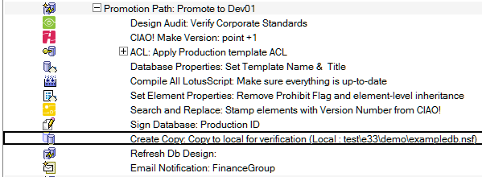

# Database Copy

Automatically create database copies.

## To Copy a Database
1. Select the Build or Promotion Path that relates to the database or template for which you want to copy.
2. Click the *Create* action button and select *Copy Database*. The Copy Database document appears.
   
3. The Copy Database document is active by default. Leave this setting.
4. Enter a descriptive name in the *Description* field (for example, *Copy of CRM for Test*).
5. Enter the *Promote to Server* name. This field cannot be blank. 
6. Enter the *Promote to Path*.  
   This field must be relative to the data directory on the destination server. Leave this field blank to specify the data directory itself. If you omit the database name, the current name is used.
7. Enter a Notes selection formula for *Copy Documents* (for example, *SELECT @ALL*) if you have documents that must travel with the database or template.
8. The Overwrite field is checked by default. This overwrites old copies of the file being copied.
   If you uncheck this setting, the *Fail on Exit*? option appears (checked by default), allowing you to specify that a promotion fails when the Overwrite field is unchecked and the destination database you are copying already exists.

Save and close the document.

The new Copy Database entry appears in the right pane, under the Build or Promotion Path to which it applies.

<figure markdown="1">
  
</figure>