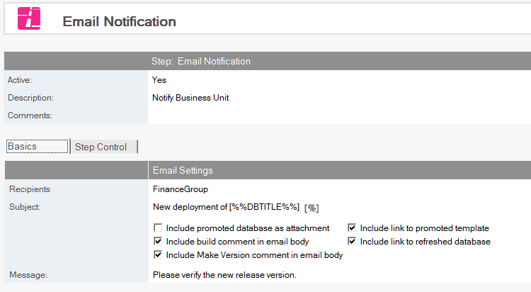
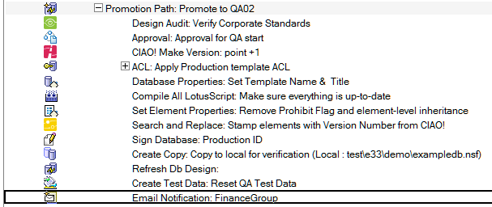

# Email Notification

Setup email notification.

## To Set Email Notification
1. Select the Build or Promotion Path that relates to the database or template for which you want to notify people or groups, via email, that the promotion was a success.
2. Click the *Create* action button and select *Email Notification*. The Email Notification document appears
   
3. The E-mail Notification document is active by default. Leave this setting.
4. Enter a descriptive name in the *Description* field (for example, *Status Report*).
5. In the *Recipients* field, click the dropdown to select names from the address book to send e-mail notification to, upon successful promotion of this database to the target server.
6. In the *Subject* field, enter the subject you want to appear in the Subject field in the e-mail notification (for example, *New template has been moved to QA*).
7. Select from among the following options, based on earlier steps in the build process.
    * Include promoted database as an attachment
    * Include build comment in the e-mail body
    * Include Make Version comment in e-mail body – Include doc link to the promoted template
    * Include doc link to the refreshed database(s)
8. In the *Message* field, enter the body of the e-mail notification (for example, *Please test this database*).

The e-mail notification contains document links to the Build Manager report and the promotion path used. The Build Manager report details the steps taken during the promotion. It is also saved in the Teamstudio Build Manager database.

Save and close the document.

The new E-mail Notification entry appears in the right pane, under the Build or Promotion Path to which it applies.

<figure markdown="1">
  
</figure>