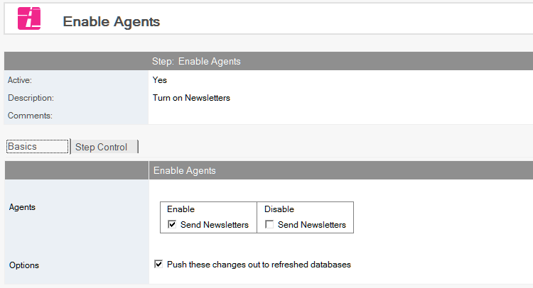
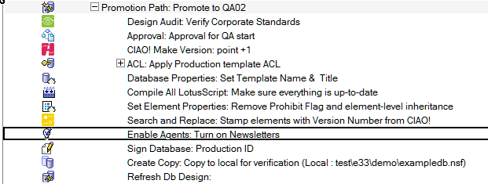

# Enabling Scheduled Agents

Enable scheduled agents.

## To Enable Scheduled Agents
1. Select the Build or Promotion Path that relates to the database or template for which you want to enable scheduled agents
2. Click the *Create* action button and select *Enable Agents*. The Enable Agents document appears.
   
3. The Enable Scheduled Agents document is active by default. Leave this setting.
4. Enter a descriptive name in the *Description* field. All scheduled or event-triggered agents in the source database appear in a table.
5. Check each agent you want enabled or disabled for the target database.
6. Check the Push these changes out to refreshed databases option if you want to force an update of the enable/disable state during a design refresh. 

Save and close.

The new Enable Scheduled Agents entry appears in the right pane, under the Build or Promotion Path to which it applies. 
<figure markdown="1">
  
</figure>