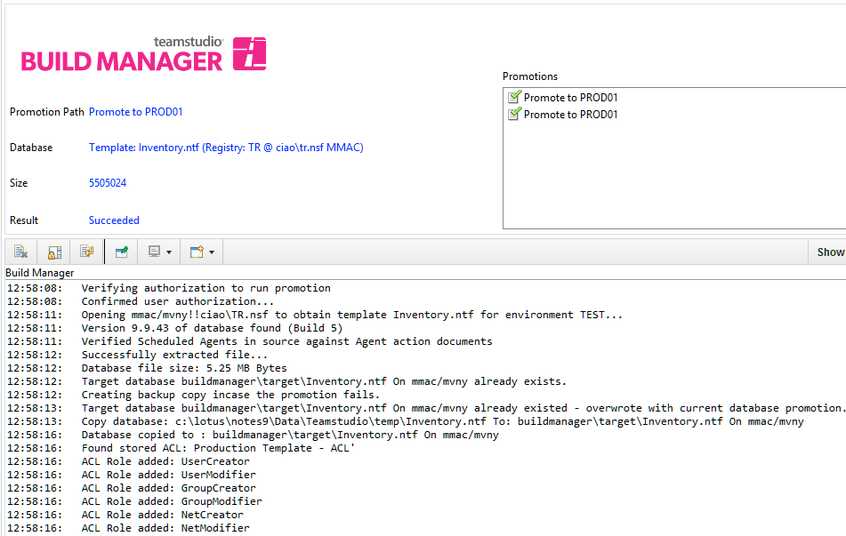
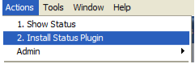

# Status Plugin

When using Build Manager with IBM Notes 8.5.1 and later, users can install and use a status plugin that displays the output of promotions running in the background. Summary status is displayed in the upper pane, and detailed output from the promotion is displayed in the lower pane. You can double-click entries in the Promotions box in the upper right-hand corner to view the traditional Build Manager log once the promotion has completed.

<figure markdown="1">
  
</figure>

## Installing the Plugin
You install the plugin on each Notes client installation where it will be used. To install the plug-in, click *Actions|Install Status Plugin* 
<figure markdown="1">
  
</figure>
You will be prompted to confirm this action, and warned that Notes must restart to complete the installation. After restart, the new Composite Application window that contains the plugin will be launched. You may close this window. The installation is complete. 

Once the plugin is installed, whenever a promotion is initiated, the Composite Application window will automatically open to display promotion status. Once the promotion has moved to the background process, you can navigate away from this window and continue to work in Notes.
If you choose not to install this plugin, cannot install it due to policies, or are running an earlier version of Notes, a shell window will open when the promotion switches to the background process, and output will be directed to the window. You can continue to work in Notes while the promotion runs in the background, but should not close this window while the promotion is active. If the window is minimized or hidden, it will flash its title bar and icon on the Windows taskbar when the promotion is complete. 

## Disabling the Plugin
Build Manager launches the plugin based on the existence of a notes.ini setting that is set by the plugin when it has been loaded successfully. You can disable the plugin by removing the notes.ini setting *$TMSBuildManagerPluginVersion*. You can remove or disable the plugin in the standard manner via the Application Management wizard in the client. 
