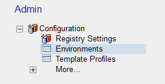

# Template Registry

## Installing and Configuring the Template Registry Database

Create a database called TemplateRegistry.nsf using TemplateRegistry.ntf as the master design.

For the Template Registry the suggested default ACL is:

| Name | Type | Access | Roles | Permissions |
|---|---|---|---|---|
| -Default- | Unspecified | No Access | None | None |
| Anonymous | Unspecified | No Access | None | None |
| BM_ADMINISTRATOR | Person Group | Manager | AddTemplateEnvs, AdminEnvs, AdminExtract, AdminProfs, RmvTemplateEnvs | All |
| BM_PROMOTER | Person Group | Author | AddTemplateEnvs, RmvTempalteEnvs | Default for author with create documents |
| LocalDomainServers | Server Group | Manager | AddTemplateEnvs, AdminEnvs, AdminExtract, AdminProfs, RmvTemplateEnvs | All |

!!! note
    There are no approver or path builder groups in this ACL. This is because only administrators
    and promoters need access to the functionality. If Build Manager path builders need the ability
    to promote databases, then these groups should be added with the same rights as the promoters.
    
## Setting up the *Default* Registry
Open the Template Registry database. In the Admin tab, expand *Configuration* and click on *Registry Settings*.
<figure markdown="1">
  
</figure>
For basic setup and initial testing, fill out the tabs as follows.

* **General** Leave the * to indicate any Build Manager can access this Template Registry

* **Default Target Environment** Enter an Environment name and a description. This will be the default Environment for promotions to the Template Registry. For instance, this can be a catch all for any development. So name it *Developed – Ready for Test* and add a description if required.  
  In the Advanced options, leave the * to allow any Build Manager to promote from here, (leave the box unchecked).
* **Target Environments** Save and reopen this document and the Default Environment will be listed.
  Other logical environments can be created from here, for example; *QA Approved*, *UAT Complete*, etc. They will all be listed here. See [Creating Additional Repository Environments](#creating-additional-repository-environments) below.
* **Approvals** This is only to be completed if approvals are required to update the versioned templates in the repository to the next stage. See [Workflow Approvals](installwa.md) for details on configuring this tab.

Save and close the document.

## Creating Additional Repository Environments
From the Admin tab click on *Environments* (or if currently setting up the Default Environment, go to the Target Environments tab) and click *Create Environment* from the toolbar.

Fill in the basic details.
<figure markdown="1">
  
</figure>
The security setting *Allow templates to be approved on Build* should be checked as default. Ignore the *Require Template Profile*. The *Build Manager Promotion access* field allows restrictions as to which instance of BM can pull templates from this registry environment.
<figure markdown="1">
  
</figure>
In the *Approvals* tab, only check the box if movements in the Template Registry are required to be authorized.