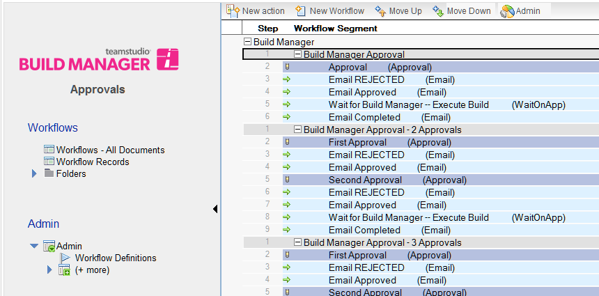
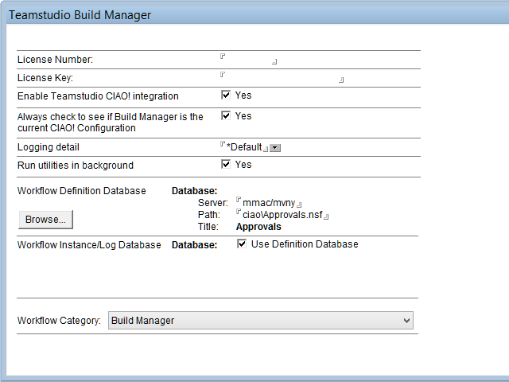
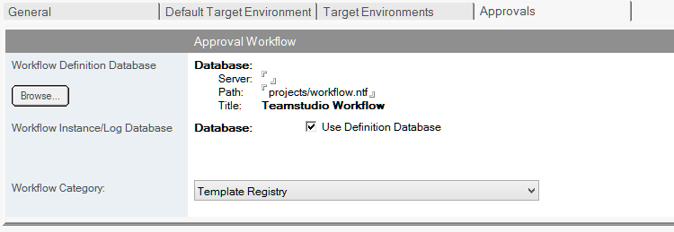

# Workflow Approvals

## Installing and Configuring the Workflow Approvals Database
### Creating a Workflow Database
1. Create a database called TeamstudioWorkflow.nsf using Workflow.ntf as the master template. This will need to reside on a server with access to send email.
2. Open the new TeamstudioWorkflow.nsf and choose  *Actions|Admin|Create Workflow Definitions* from the menu. This will create the new default workflow documents as below.
   
3. Make sure any approvers have at least Author access to the TeamstudioWorkflow.nsf database.
4. Close TeamstudioWorkflow.nsf.
### Configure Workflow in Build Manager
1. Open the Build Manager instance.
2. Click the *Build Manager* button on the toolbar and go to *Settings*.
3. Fill in the Workflow Definition Database section and the Workflow instance/Log Database with the details of the location/name of your workflow database.
4. It is important to set the *Workflow Category* to *Build Manager*. From the *Workflow Category* dropdown select *Build Manager*. You may now click ok and repeat with any other Build Manager instances you require to work with the Workflow database that you've created.
<figure markdown="1">
  
</figure>
### Configure Workflow in Template Registry
You will also need to configure any Template Registry instances where you want to use Workflow Approvals to use the new workflow database. Similar to what you did with the Build Manager instances, you need to configure Template Registry with the location and Workflow category settings as follows.

1. Open the Template Registry instance.
2. Under the *Admin* menu on the left pane, select *Configuration|Registry Settings*.
3. The Registry Settings page will open, where you now need to select the 4th tab *Approvals*.
4. Fill in the Workflow Definition Database section and the Workflow instance/Log Database with the details of the location/name of your workflow database. You may also enable the checkbox to *use the definition database*. 
5. As with the Build Manager instance, it is important to set the *Workflow Category*, but this time to *Template Registry*. From the *Workflow Category* dropdown select *Template Registry*. You may now close and save the document.
<figure markdown="1">
  
</figure>