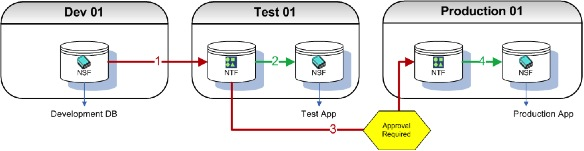

# Introduction

Build Manager is a tool for the comprehensive control of the movement of Notes database templates from one environment to another. It improves efficiency by automating the steps necessary to make a template ready for the next environment. It mitigates risk by ensuring all necessary steps are completed as specified, thus reducing the risk of human error. Finally it assists with compliance to regulatory standards by ensuring the enforcement of segregation of roles- all at the push of a single button!
 
Welcome to the world of One-Click Builds.
 
Fundamentally, there are two ways to utilize Build Manager

* A *push* model, maybe similar to automating a manual process that you currently perform.
* A *push/pull* model using a storage facility called the *Template Registry*.

The following sections describe the two main ways Build Manager can be configured. You or your administrator will have set up one of the two methodologies ready for you to start executing automated builds of your applications.
 
Using the features of Build Manager in either methodology is similar, the difference being where you are promoting databases to and from.

!!! note
    The following topologies represent a classical 3-Tier environment. These are logical environments,
    not physical (i.e. it does not matter if all three environments are on the same machine, separate
    machines or even in different domains). If you have more that three tiers, for instance a UAT or
    Staging tier (or both) you can extrapolate these ideas by assuming the Test environment may be
    duplicated and configured to fit the needs of your current topology.
    
## *Push* Model
Build Manager can be utilized to replace any manual Build Process currently in place. As part of promoting databases from one environment to another, for example from Dev to Test, various actions can be performed against the code and the database properties. This all occurs automatically and is configured by the Build Manager administrator.

<figure markdown="1">
  
</figure>

1. Developers complete work on their designs and promote (*push*) to Test.  Some or all of the processes described in the *Build Steps* section below have been configured to be automated by the Build Manager administrator.
2. Testers can then perform the testing required and then once completed can then promote to Production. Some or all of the processes described in the *Build Steps* section below have been configured to be automated by the Build Manager administrator.
3. If configured, the system is paused and a promotion request email is sent to an approver. An email will be sent to the *promoter* to notify if and when the approval is given. The *promoter* can then continue to move the database to the required environment.

!!! note
    Email authorization can occur at any or all the number steps if desired e.g. from development to test.
    
## *Push/Pull* Model using the Template Registry
The other way that Build Manager can be used is to incorporate a *push/pull* model. Rather than the databases always being *pushed* from one environment to the next an optional component, the *Template Registry*, allows developers to perform continuous builds while other individuals can then choose which versions and when to promote databases to another environment.

There are two main advantages using this method

* No accidental overwriting of databases. All databases are stored in the Template Registry so authorized users of other environments, for example Test, can *pull* down designs when they need to as opposed to developers *pushing* databases onto Test servers and then refreshing the design causing the current database to be overwritten, maybe part way through testing.
* Faster rollback - The Template Registry contains complete versions of your designs, and they are flagged as being completed for a particular stage in your development process, for example, *Tested, ready for production*. If a version of the database gets to production that, unfortunately contains a bug and rollback is required, an administrator can simply select the previous working version from the Template Registry and perform the promotion (*pulling*) to production on this earlier version

The following topology is a logical representation of a 3 tiered environment (Dev, Test and Production) with Teamstudio Build Manager implemented. The Template Registry usually resides on the Development Server.

<figure markdown="1">
  
</figure>

1. Developers can complete work and promote (*push*) up to a repository, versioning as they do so, allowing the most up to date versions of their designs to be eligible for testing. Developers can develop in either NTF or NSF format and can push versions into the Template Registry as often as they like.
   Some or all of the processes described in the ‘Build Steps’ section below have been configured to be automated by the Build Manager administrator.
   

     
Note

       The promotion of the DB to the Template Registry, if configured, can automatically rename NSFs to the NTFs.
     

   

2. Once in the Registry, the test team can pull versions down to the Test Servers and commence testing. Versions of the templates may be chosen manually at promotion time or the latest template will be moved to the Test environment. This is configured by the Build Manager administrator.
   This allows testing to be independent and not rely on developers pushing updated dbs/templates direct to the Test Server overwriting templates already under test.
   Some or all of the processes described in the *Build Steps* section below have been configured to be automated by the Build Manager administrator.   
3. Once tested, the template can be approved from *Developed – Ready For Test* to *Tested - Ready for Production* within the Repository.
4. The Template can be pulled down from the Template Registry to Production by an authorized user.
   If configured, the system is paused and email verification is sent to an approver. An email will be sent to the promoter to notify if and when the approval is given. The promoter can then continue to move the database to the required environment.
   Some or all of the processes described in the *Build Steps* section below have been configured to be automated by the Build Manager administrator.
   

     
Note

       Email authorization can occur at any or all the number steps if desired e.g. from development to test.
     

   

   
!!! note
    If required the DB refresh of design will occur on a promotion if necessary. The Build Manager Administrator will configure this.
     
!!! note
    Rollback can be expedited almost immediately. As prior versions of the template are stored in the Repository, if a new released version has a showstopper bug that requires rollback, an earlier version from the Repository can be selected to be pulled to the Production server. Any authorization required for promoting to a Production Server will still be enforced.    