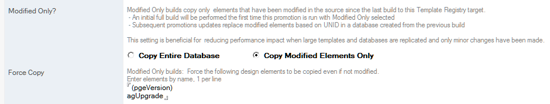

# Modify-Only Builds

Modified-Only builds help reduce the impact of design refreshes on production servers and subsequent replication of updated databases, while allowing good-practice use of Sign and Compile steps. 

!!! note
    This feature requires careful planning and precise configuration to be effective, and may not be desired for most applications. However, large applications (with many views, or many images), and applications with remote users with low bandwidth connections will benefit from this feature. 

When this feature is not enabled, databases are copied in the same manner as previous versions of Build Manager.

This feature can only be enabled for builds to a Template Registry database, and can be enabled on the Build Path
<figure markdown="1">
  
</figure>

## Behavior
When *Copy Modified Elements Only* is selected

* On the first build, the entire database is copied and stored in the Template Registry, along with timestamps that can be used in future builds to limit updates to modified elements. 
* On subsequent builds, the following occurs
   * The prior version from the Template Registry is extracted to a temporary file, along with the timestamps collected when it was created.
   * The timestamps are used to query the source template and copy only the elements that have been modified in the source since the last build.
   * A timestamp for the temporary file is passed on to any Sign and Compile steps in the promotion, allowing them to act on only those elements copied in or otherwise modified during the promotion (e.g. due to enabling agents, setting element properties, etc). 

## Signing and Compiling
The Compile step builds a list of elements dependent on any LotusScript Script Libraries that were copied or modified since the copy operation, and compiles them all in the order of dependency.

Consequently, more elements than modified in the source may be compiled and modifying libraries used by many elements (e.g., all views) may have drastic effect.

Dependencies can only be detected for elements that explicitly contain a *Use* statement for another element higher in the dependency list.

The Sign step will act on any modified documents since the copy operation, including all newly compiled elements.

## Implications
*  Changing the source, for example, recompiling all LotusScript or replacing the source template with a copy, can significantly affect what gets copied. When replacing the source template with a new copy, you should disable Modified-Only for a single promotion as it will guarantee a good baseline copy.
 * Because the new copy is based on the prior version from the Template Registry, elements not modified in the source won’t be copied, which can have side effects. For example, if a Search and Replace step replaces a tag in a subform with the current version number, this will only occur when the subform is modified in the source. When it has not been modified, it will still have the version number it got when it was last updated. To address this issue, list elements in the *Force Copy* field on the Build Path to ensure they are always copied and updated.
*  Because Modified-Only builds can only be used going into a Template Registry, running a Sign or Compile step on the promotion out of the Template Registry will affect all elements, and undo the benefits of using Modified-Only. To avoid this, Sign, Compile, and otherwise configure the template for the target environment on the build into the Template Registry.
*  You can perform a Modified-Only build from one Registry target to another. For example, you can use the first Modified-Only build to configure the template for a QA environment, and use a subsequent Modified-Only build to pull from that Registry and configure the template for Production while building to another Registry target. 