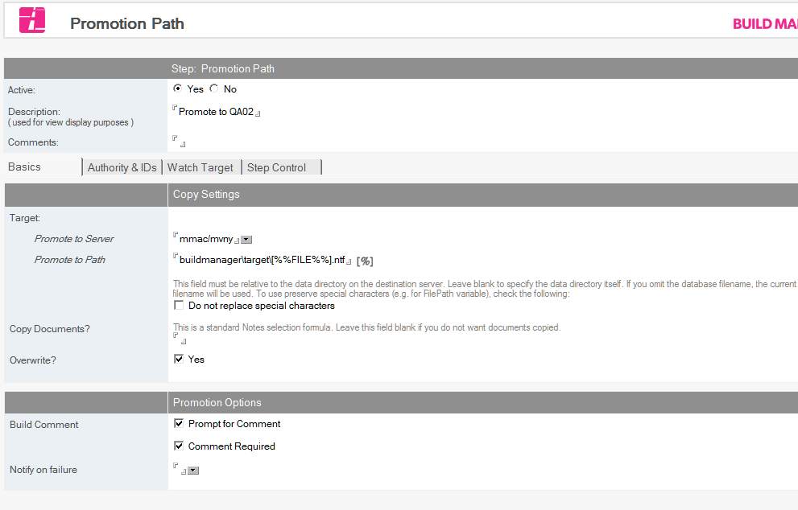

# Creating a Promotion Path

Build Manager can promote templates to two types of targets.

* Promotion Paths are used to Promote a template to a server and file path, and are used to move templates into new environments for deployment.
* Build Paths create a build (version) of a template in a Template Registry, as part of a release control process. Templates in a Template Registry can later be deployed to environments using Promotion Paths.

This help topic covers creating a Promotion Path.  For information on Build Paths, see [Creating a Build Path](bpcreate.md)

Promotion Paths specify a server and path where an application template can be promoted. You can create multiple promotion paths for each of your watched databases. To configure a promotion path document, you create and name the promotion path, enter the copy settings, and select the promotion options.  Build steps can be created as child documents for the promotion path, to enable additional build steps.

## To Create and Name a Promotion Path
1. From the CIAO Config database, select the database document you want to create a promotion path for.
2. From the *Create* menu, click *Promotion Path*. You see the Promotion Path document.
   
3. Select *Yes* beside the *Active* field, if not already selected.
4. In the *Description* field, enter a name describing the promotion path, for example, *Dev>QA*.
   This field cannot be blank and must be unique. 

### If the source is a template stored in a Template Registry
The Registry Settings pane is displayed. Select the *Version Options* setting that should be used to determine the build to be promoted. Optionally, configure *Deployment Tracking*. The choice of *Template Registry* and *Template* are determined by the settings of the parent Database document. 

### To configure the copy settings for the promotion path
You can configure the copy settings for the promotion path as follows.
1. From the Promotion Path document, select the *Basics* tab. 
2. In the *Promote to Server* field, select the server you want to promote the database to. This field cannot be blank.
3. In the *Promote to Path* field, enter the path where the database should be promoted.
   This field must be relative to the data directory on the destination server. Leave this field blank to specify the data directory itself. If you omit the database name, the current name is used.  
   The blue percent sign (%) at the top of the page indicates that you can use replacement macros in this field. Click the blue percent sign to view all options. A grey percent sign at the top of the page indicates that you cannot use macros in the selected field.
4. Enter a Notes selection formula in the *Copy Documents* field (for example, *SELECT @ALL*) if you have documents that must stay with the database or template.
5. To overwrite old copies of the file being promoted, ensure the *Overwrite* field is checked.
   Unchecking this setting causes the promotion to fail if the target database already exists. 
   
### To limit which users can run a Promotion
List users who are allowed to run the promotion on the *Authority & IDs* tab.

### To run the promotion as an alternate ID
Select an ID to use on the *Authority & IDs* tab.

### To configure Promotion Path options
You can configure the promotion options of the promotion path as follows.

1. To prompt the person promoting the database to enter a *Promotion Comment* during promotion, check *Prompt for Comments*. To require the comment, also check *Comment Required*.
2. In the *Notify on failure* field, browse to select names from one or more address books to designate who to e-mail upon failure of a promotion.  
   The promoter (the person who clicks the Promote button) is always notified with a status window at the end of the promotion. 

###To configure CIAO Watch options for the target NTF produced by the promotion
CIAO can be configured to enable a CIAO watch on the target of a Promotion

1. From the Promotion Path document, click the *Watch Target* tab.
2. Select *Yes* for the *Watch New Database* field, if you want CIAO to watch the target database.
3. In the *Destination Configuration Server* field, use the selection button, or enter the name of the server with the configuration database
4. In the *Destination Configuration Path* field, use the selection button, or enter the path to the configuration database that you want to monitor the promotion template.
5. In the Destination *Log Server* field, optionally use the selection button, or enter the server name for the log database you want the promoted database to use.
6. In the *Destination Log Path* field, use the selection button, or enter the path to the log database that you want the promoted database to use.
7. Save and close the document.