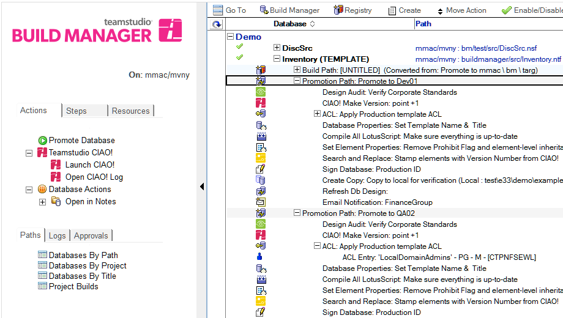

# Promotion Paths

Three types of Build Manager documents form the basis for building and promoting databases.

* **Database Documents**, also called CIAO! Configuration or *Watch* documents, define the *source* location - the source template of an application where development takes place.
* **Promotion Paths** define a target location - a server and path where the source template should be copied. [Build steps](buildsteps.md) can then be run against this target to prepare it for release.
* **Build Paths**, which are identical to Promotion Paths, except that the target they specify is a Template Registry, a database where versions of templates can be stored and tracked.

<figure markdown="1">
  
</figure>

## Database Documents
The design of Database Documents is largely based on Teamstudio CIAO! Configuration documents that specify how CIAO! should watch (and control access to) a template.   When using CIAO!, A Build Manager database can be used in place of a CIAO! configuration, allowing Build Manager to integrate more deeply with CIAO!

Teamstudio CIAO! configuration options can be found in the CIAO! documentation, and are identical.  Build Manager does not require CIAO!

Build Manager uses the Database Document to identify the source template which the build will copy and act on, and can be created
* By choosing the *Build Manager* view menu button and choosing *Add Database* to add a source template that exists on a server.
* By choosing  the *Build Manager* view menu button and choosing *Add Template From Registry* to add a source template that is stored in a Template Registry.

## Promotion Paths
Promotion Paths specify a target location to *promote* a template.  Promotion paths copy the source template to the target location, and run the child Build Steps against the new copy.  Typically, a Promotion Path will include a child step to refresh the design of one more databases in the environment (e.g. QA, UAT, Production) where the template has been copied, or promoted.

To create a Promotion Path, select the Database document that identifies the source template, and choose *Create|Promotion Path*. 

## Build Paths
Build Paths specify a Template Registry as the target for a template.  Build paths copy the source template to a temporary local location, and run the child Build Steps against the new copy. The newly built template will then be attached to the specified Template Registry, along with version and build information and other useful metadata.  Once template versions have been created in a Template Registry, a new Database Document can be created to allow Promotion Paths to extract those templates into target environments.

To create a Build Path, select the Database document that identifies the source template, and choose *Create|Build Path*.

## The Template Registry
The Template Registry acts as a storage facility that keep each built version of a template in a secure environment that maintains metadata about the version, build number, source template, and so on.  Template registries can help with change control efforts, providing roll-back to known good versions without a full restore and rebuild cycle, and tracking of approved target environments for different versions, including Approval Workflows when needed.

More information on how Template Registries fit in the Build Manager topology is available [here](intro.md).

As of Build Manager 8.0, Build manager can also track deployments and update a custom status value to the Template document in the Template Registry when a version has been deployed to a target environment.  More information on Template Registry Deployment Tracking is available [here](tracking.md).