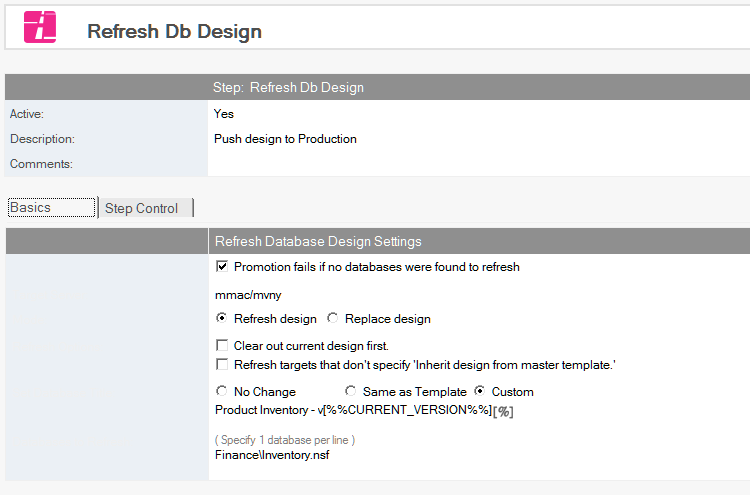
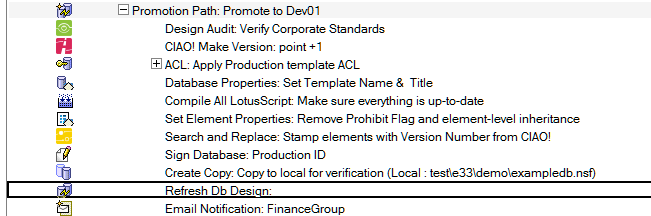

# Refresh/Replace Design

Refresh the design of a database or list of databases.

!!! note
    Certain options available in this step can cause unexpected results. See the
    [Special Options](#special-options) section below to understand how these options differ in
    behavior from the standard Notes client operations.
    
## To Refresh/Replace the Design of a Database
1. Select the Build or Promotion Path that relates to the database or template for which you want to automatically refresh the design.
2. Click the *Create* action button and select *Refresh Design*. The *Refresh Db Design* document appears.
   
3. Enter a descriptive name in the *Description* field (for example, *Refresh Design List*).
4. Deelect the *Promotion fails if no databases were found to refresh* option if you are refreshing the design of a group of databases and you do not mind if one (or more) of those databases does not exist
5. For Target Server, select the server on which to refresh databases.
    * If the Build Manager administrator has setup refresh restrictions, this field only lists the target server for the promotion.
6. For mode, select either *Refresh design* or *Replace design*.  See [Special Options](#special-options) below for a detailed explanation of the options available for each setting.
7. In the *Set Database Title* field, select
    * **No Change** Retain the current database title
    * **Same as Template** Use the same title as the template that you are refreshing from
    * **Custom** Enter the new name
8. In the *Databases to Refresh* field, enter the path of each database that requires refreshing once the template has been moved to the target server. The path is relative to the data directory of the target server.

Save and close the document.

The new Refresh Design entry appears in the right pane, under the Build or Promotion Path to which it applies. 
<figure markdown="1">
  
</figure>

## Special Options
!!! note
     Build Manager provides special options for design replace and design refresh that cause the
     behavior to vary significantly from that of the Notes client operations. Be sure to understand
     the warnings below before configuring these options. 
     
### Design Refresh Options
1.  **Clear out current design first** If checked, deletes all design elements from the target database prior to refreshing the design. See [Side effects of Deleting Design](#side-effects-of-deleting-design) below.
2.  **Refresh targets that don't specify 'Inherit design from master template'** If checked, calls the design refresh API even if the target doesn't have a master template defined. Useful for updating elements that inherit at the element level.

!!! note
    To match the Notes client's Design Refresh option, leave option 1 unchecked and check option 2.
    
### Design Replace Options
1. **Keep new template name**  If checked, Build Manager will leave the new template name in the target database.  By default (unchecked), it removes the *Inherit from master template* name in the target after the refresh.
2. **Refresh only (do not delete current design first)** If checked, Build Manager does not delete the design of the target database prior to the refresh. See [Side effects of Deleting Design](#side-effects-of-deleting-design) below.
3. **Respect 'No Refresh' options in target database** If checked, the design deletion will not delete elements that have *Prohibit design refresh from replacing* checked (only available if option 2 is unchecked).

!!! note
    To match the Notes client's Design Replace option, check options 1 and 2.
    
### Side-Effects of Deleting Design
Options that trigger the deletion of the target database's design prior to refreshing/replacing have important side-effects that should be carefully considered.
 
When one of the following configurations is used, Build Manager will delete the design of the target database before updating it

* Design Refresh with *Clear out current design* checked
* Design Replace with *Refresh only* unchecked

Side-effects of deleting the design include

* Folders will lose their document membership, since the folder deletion and recreation essentially creates a new folder.
* Design refresh will not be able to skip updating design elements that haven't changed, which  defeats the purpose of *Modified Only Builds*.
* If Design refresh fails after the deletion, the target database may be left empty of design or with an incomplete design.

It is therefore recommended that design deletion settings only be used when absolutely necessary.