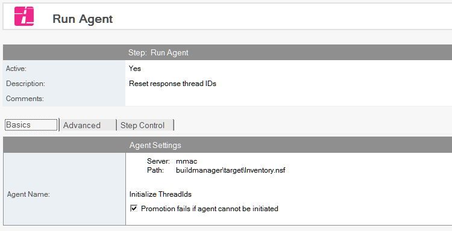
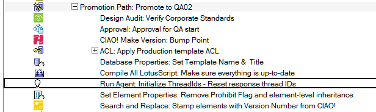

# Run Agent

Run an agent.

# To Run an Agent
1. Select the database document for which you want to run an agent.
2. Click the *Create* action button and select *Run Agent*. The *Run Agent* document appears
   
3. The Run Agent document is active by default. Leave this setting.
4. Enter a descriptive name in the *Description* field (for example, Run Agent).
5. Click *Browse* to select the database containing the agent that you want to run.
6. Click *Get Agents* to populate the Agent Name dropdown.
7. Select an agent.
8. If you want to fail the promotion if the selected agent fails to run, check the *Promotion Fails if the agent cannot be initialized* checkbox.

   The following steps require you to perform additional setup detailed in a separate procedure and require the inclusion of additional LotusScript libraries and code modifications. See “Using the Advanced Features of Run Agent,” below.

9. If you want to pass parameters to an agent or check its status after it runs, check the *Enable additional options using agent parameter database* checkbox in the *Advanced Options* section.
10. The following advanced options appear.
     * Get agent status from parameter database after agent runs
     * Include messages from the agent in the promotion log
     * Pass parameters to agent
11. If you want, check the *Get agent status from parameter database after agent runs*.
12. Check *Fail promotion if the agent does not confirm success* if you want the database promotion to fail if the agent does not run to completion.
13. If you want, check the *Include messages from the agent in the promotion log* checkbox
14. If you have parameters you want to pass to the agent, check the *Pass parameters to agent* checkbox.

Save and close the document.

The new Run Agent entry appears in the right pane, under the database to which it applies. Note: Build Manager calls the agent you specify with Run Agent using the NotesAgent.RunOnServer() method in LotusScript.
<figure markdown="1">
  
</figure>

## Using the Advanced Features of RunAgent
Use the following two-part procedure to set up Build Manager to use the advanced features of Run Agent, including passing parameters to the agent, logging messages from agent, and confirming successful completion of an agent.

Part One: set up the database and signers on the target server.

1. Make sure AgentParameters.nsf is saved in the Teamstudio directory of the target server (the server where the database containing the agent is located).
2. Make sure the ID promoting the database in Build Manager has Editors rights for AgentParameters.nsf.
3. Make sure the signer of the target agent has Editor rights for AgentParameters.nsf. 

Part Two:

1. Include the TSAgentParameters library and code to call it.
2. Copy the TSAgentParameters script library from AgentParameters.nsf.
3. Use your custom code to call the methods exposed by the global object

Include the library in the options section
``` vbnet
Option Public
Option Declare
Use "TSAgentParameters"
```

Check that the TSAgentParameter object was created. Build Manager always passes NoteID. If you call the agent without this parameter, no object is created.
``` vbnet
Sub Initialize
  If Not TSAgentParemeters Is Nothing Then
    'a ParameterDocID was found and the global instance of TSAgentParameters was loaded...
```
Check if it registered an error, for example if it couldn’t find the document or the parameter db.
``` vbnet
If TSAgentParameters.ErrorNumber <> 0 Then 'test to see if it had errors
  Error TSAgentParameters.ErrorNumber, TSAgentParameters.ErrorMsg
End If
```

Get a single parameter by name.
``` vbnet
Dim sResult As String
sResult = TSAgentParameters.getParameterValue("aStringParam")(0)
``` 

Get all parameter names as an array.
``` vbnet
Dim paramNames As Variant, i As Integer
paramNames = TSAgentParameters.getParameterNames()
```

Log a message to the parameter DB.
``` vbnet
Call TSAgentParameters.logMessage("Successfully updated configuration document.")
```

Mark status complete. This is what lets Build Manager know if the agent completed successfully.
``` vbnet
Call TSAgentParameters.markComplete()
```

Get all parameters in a LotusScript list variable
``` vbnet
Call TSAgentParameters.getParameterList(vParamList) 'pass in the list to be populated with values
Forall param In vParamList 'convert the list into name-value pairs
  sPairs = sPairs & Listtag(param) & " = " & param(0) & Chr(13) '(assumes no multi-values)
End Forall
```
A complete example.
``` vbnet
Sub Initialize
  If TSAgentParameters Is Nothing Then
    'no note id was received form NotesAgnet.ParameterDocID
    '(the agent was called with run() w/o note id, or via UI, etc)
    'do nothing, throw errors, or do alternate processing
  Else
    If TSAgentParameters.ErrorNumber <> 0 Then
      Error TSAgentParameters.ErrorNumber, TSAgentParameters.ErrorMsg
    End If
    
    Dim s As New NotesSession
    Dim db as NotesDatabase
    Set db = s.CurrentDatabase
    Dom doc As NotesDocument
    Set doc = db.GetView("(configuration)").GetFirstDocument()
    
    Dim paramNames As Variant, i As Integer
    paramNames = TSAgentParameters.getParameterNames()
    
    For i = 0 To Ubound(paramNames) 'copy each item to the document
      Dim tmpItem As NotesItem
      Set tmpItem = TSAgentParameters.copyParameterItemToDoc(paramNames(i), doc, paramNames(i))
      If Left$(paramNames(i), 8) = "Authors_" Then 'using a naming convention for params makes it easy to set addl properties
        tmpItem.IsAuthors = True
      End If
    Next
    
    Call doc.Save(True, False)
    
    Call TSAgentParameters.logMessage("Successfully updated configuration document")
    
    Call TSAgentParameters.markComplete()      
  End If
End Sub
```