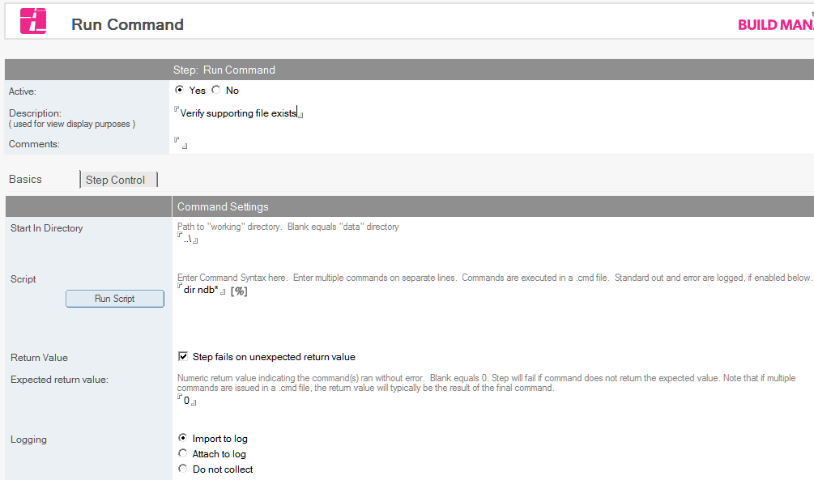
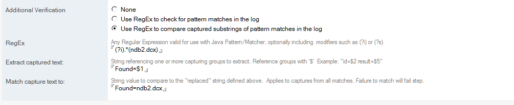

# Run Command

Initiate and monitor a Windows command-line program or set of commands, and log and parse the output of the command.

This can be used for a wide variety of applications, from simply checking if a file or process exists, to updating information on remote servers via tools like cUrl.

!!! note
    This step is new in Build Manager 8.0
    
## To Run a Command
1. Select the Promotion path document to which you want to add the Run Command step.
2. Click the *Create* button and select *Run Command*. The *Run Command* document appears.
   
3. In the Run Command document, the Active radio button should be *Yes*. Fill in the *Description* and any desired comments.
4. Enter the command to run in the *Script* field.  This may be a single command-line command, a program to execute, or a series of commands, one per line.
5. Optionally, enable *Step fails on unexpected return value* to fail the step if the return value of the command does not match. Note that when multiple commands are issued, only the return value of the last command will be returned/tested.
6. *Logging* can be enabled either by importing or attaching the output of the command(s). Build manager will capture both Standard Out and Standard Error in this log.  
7. Additional validation of the results can be accomplished by enabling *Additional Verification*
   
8. A Regular Expression can be specified in *RegEx* to provide pattern matching and capturing capabilities to test the results.
9. If using capturing, a string template can be provided to receive the selected captures, and a string can be provided to compare it to. See the following section for details.

## Capturing Values via RegEx
When *Use RegEx to compare captured substring of pattern matches* is selected, Build Manager will process the verification in the following manner

* Find each matching instance of the pattern in the log.
* For each match, replace $ indexes in the *Extract captured text* field with values from groupings in the RegEx, creating a *replaced match*.
* Compare each *replaced match* created in the last step to the value provided in the *Match capture text to* field.
* If any of the replaced matches match, the step will succeed, otherwise the step will fail.

For example, a RegEx like *.\*processed=(\\d)\\s\*.\*isnew=(\\d).\** and a Match string of *[1][1]* could be used to check if any line contained *processed=1; isnew=1* while failing to match any other values for *processed* or *isnew*.
