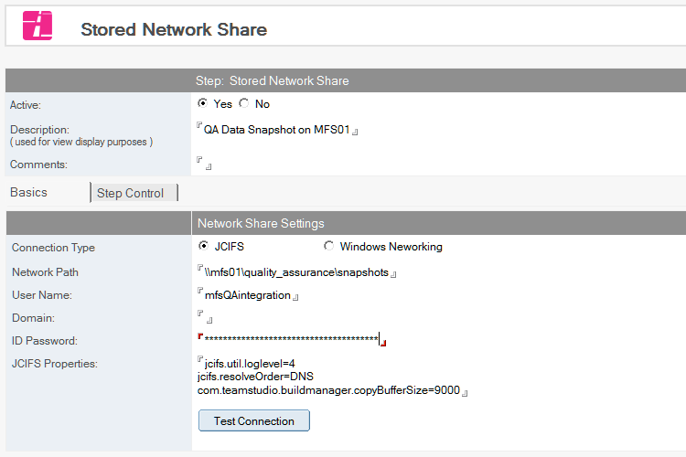

# Stored Network Shares

!!! note
    This feature is new in Build Manager 8.0
    
The Stored Network Shares feature allows the saving of a network share location - along with credentials to access that resource - inside Build Manager. This enables the Build manager Administrator (the person who will be creating Promotion Paths on a regular base) to create Promotion Paths which utilize the share's credentials without actually granting them access to the password. 

Network Shares are currently only utilized in the [Create Test Data](testdata.md) step.

Build Manager can connect to Network Shares using either built-in Windows networking features, or via the open-source JCIFS library. See the section below on Connection Types for important information about licensing, source code, and pros and cons of each approach.

## To create a Stored Network Share
1. From the Resources tab, select Resources then *Create Resource|Create Stored Network Share*.
2. Active is set by default. Do not change this.
3. Enter a description. The description will be used to select the share in other steps.
4. Choose a *Connection Type* (see the section below for details on the pros and cons of connection types)
    * JCIFS will use the open-source Java library from [https://jcifs.samba.org/](https://jcifs.samba.org/)
    * Windows Networking will use Windows APIs similar to NET USE commands.
5. Enter *User Name*, *Domain* (if needed), and *Password* to define the credentials to use when connecting
6. *JCIFS Properties* If using JCIFS, any valid JCIFS properties can be set to improve performance. See [https://jcifs.samba.org/src/docs/api/](https://jcifs.samba.org/src/docs/api/) for details.
7. Save and close. 

<figure markdown="1">
  
</figure>

## Connection Types
Build Manager supports connecting to Network Shares using either built-in Windows networking features, or via the open-source JCIFS library.

JCIFS is distributed under the GNU LESSER GENERAL PUBLIC LICENSE. A full copy of the license, along with source code, can be accessed in Domino Designer, in the *Page* design element (BMSupportingFiles) inside the Build Manager database. More technical details can also be found there. Build Manager uses the JCIFS library by dynamically linking the unmodified JCIFS JAR from a small utility JAR, the source of which is also included.

The native windows option uses Windows APIs (equivalent to "NET USE" commands). There are pros and cons to each.

### Windows APIs
#### Pros
* Minimal configuration required.
* No installation of 3rd party software required.
* Generally works with all standard UNC\SMB\Windows file-sharing services

#### Cons
* Potentially less secure as there is no way to guarantee complete closing of a connection until the windows session is ended. See security note below.

### JCIFS
#### Pros
* More configurable.
* Does not leave access to share for the remainder of windows session - the connection is only available through JCIFS client.

#### Cons
* Requires JAR installation and restart.
* More complex to configure and troubleshoot.
* Does not currently support SMB v3.

### Security
When using NET USE or equivalent Windows APIs - even without mapping a share to a drive letter - shares can remain available in the current user's windows session until it ends. This is probably of little concern for users are accessing read-only directories via Build Manager, or if the step is set to run on the server (as server sessions are typically not accessible to non-admin users).
If a higher level of security is required when the Copy Data step is run on the client, the JCIFS option may be used.  

### Installing JCIFS
To run JCIFS, the JCIFS JAR file, along with the Build Manager utility JAR file must be installed in the local Notes/Domino install's jvm/ext folder (typically <ND_exe_directory>\jvm\lib\ext).

When a step is run requiring JCIFS and set to run on the local Notes client, Build Manager will offer to install the JAR files.  After install, Notes must be restarted.

To install on a Domino server, save both JAR files (located in the Page design element *BMSupportingFiles*) to the servers EXT directory, and restart the server. Because of the required restart and the general administrative and security concerns of a server environment, Build Manager will not offer to install these files on a server.