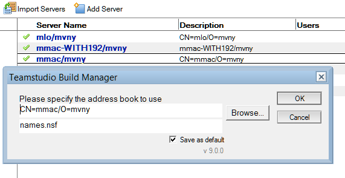
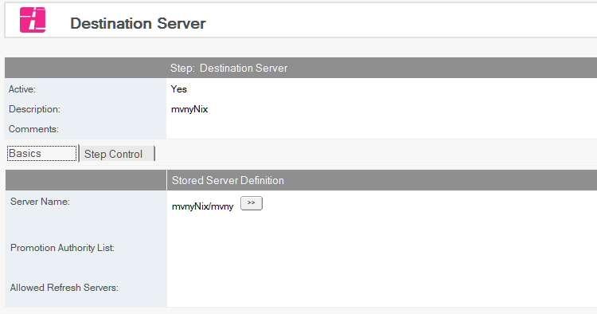

# Stored Servers

You must define a list of servers to which you want to promote databases. From a stored server document you can also predefine who can promote to each of those servers. This improves security by separating server access authority from the authority to create an action.

Stored servers may either be specified manually or imported from the Domino® Directory.

## To Import Servers
1. From the Resources tab, choose *Resources|Stored Servers*.
2. Click the *Import Servers* action button.
3. Click *Browse* and specify the address book to use.
   
4. Click OK.
5. Each server listed in the Domino Directory will have a Stored Server document.
6. Delete any servers that are not valid targets
7. Modify each of the Stored Server documents as follows:
   * Click the dropdown beside the *Promotion Authority List* field and select one or more users and/or groups who have the authority to promote to this server. 
   * When creating promotion paths to this server, any names listed in this field become the only allowed users of that promotion path.
7. Click the dropdown beside the *Allowed Refresh Servers* field and select a server that can be refreshed or *All* When promoting to the specified server. The servers listed are the only servers allowed to refresh databases.
8. Save and exit.

<figure markdown="1">
  
</figure>
