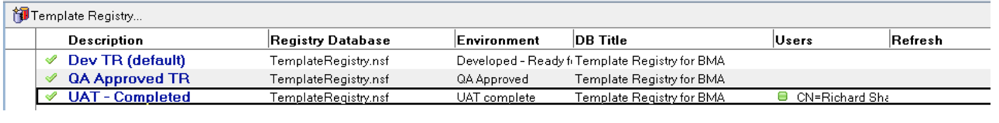
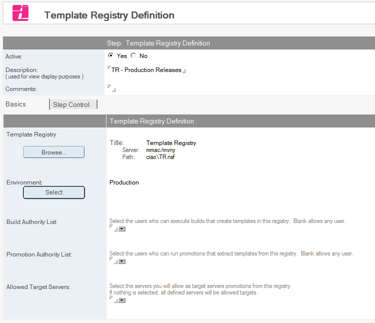

# Template Registries

!!! note
    The server the Template Registry resides on (even if it is on the same server as the Build Manager configuration database) must be added to (or already listed in) the *Stored Servers* category.
    
The Template Registries View lists all configured stages in the Template Registry that have been configured to work with this instance of Build Manager. 

<figure markdown="1">
  
</figure>

## To Create a Template Registry Stage
1. Click the *Template Registry...* button on the toolbar, select *Add New Registry*.
   
2. *Template Registry* Select the Template Registry database.
3. *Environments* Add the registry stage that has already been created.
4. *Build Authority List* Select users from the NAB that can execute builds to this registry stage.  
   Blank allows any user.
5. *Promotion Authority List* Select users from the NAB that can execute promotions from this registry stage.
6. *Allowed Target Servers* Specify servers that will be the targets of promotions from this registry stage.
7. Save and close.
