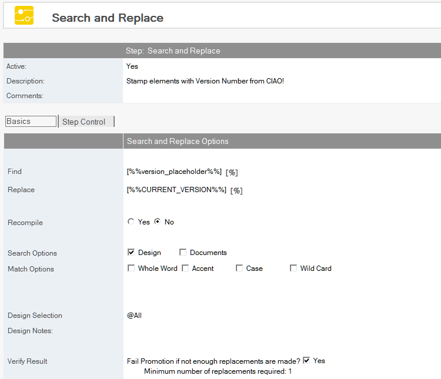
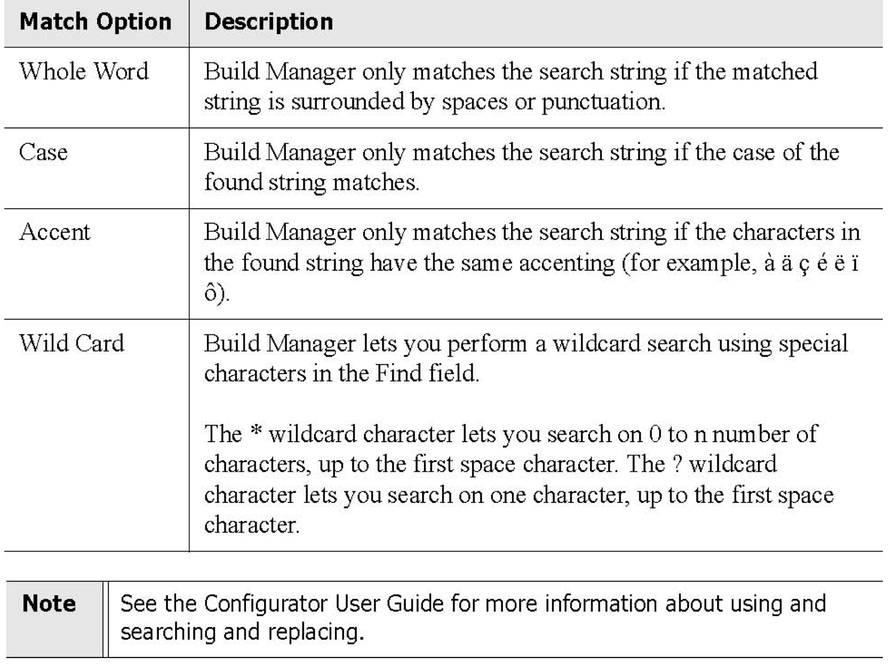
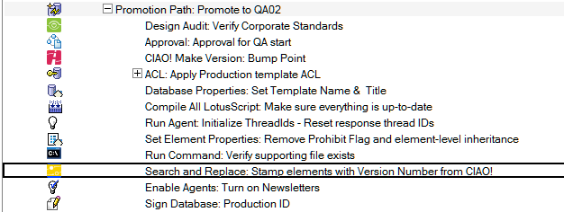

# Search and Replace

Perform a search and replace in a database.
!!! note
    This action requires that a licensed copy of Teamstudio Configurator is installed on each
    workstation that is performing a promotion.
    
## To Create a Search and Replace
1. Select the Build or Promotion Path that relates to the database or template in which you want to search and replace text.
2. Click the *Create* button and select *Search and Replace*. The *Search and Replace* document appears.
   
3. The Search and Replace document is active by default. Leave this setting.
4. Enter a descriptive name in the *Description* field (for example, change email address).
5. Enter the text you want to find into the *Find* field (for example, testers@teamstudio.com).
   Note: The blue percent sign (%) indicates that you can use replacement macros in this field. Click the blue percent sign to view all options.
6. Enter the text you want to replace it with into the Replace field (for example, users@teamstudio.com).
7. Specify if you want to recompile after the replacement is complete (*Yes* or *No*)
8. Select a search option (*Design* and/or *Documents*).
    * If you want to search by design, enter *@All* for the entire design (default) or enter other criteria.
    * If you want to search by document, specify View or Formula. In either case, specify the view or the formula.
9. Select one or more Match options.   
   
   
Check the Verify Result box if you want the build to fail if a threshold of replacements is not made.

The new Search and Replace entry appears in the right pane, under the Build or Promotion Path to which it applies. 
<figure markdown="1">
  
</figure>