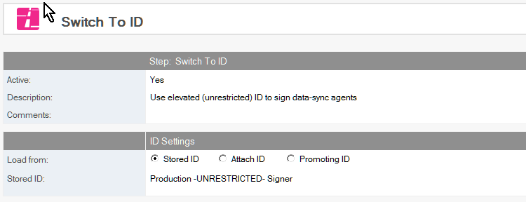

# Switch ID

Switch to another Notes ID during a Build Manager promotion.

## To Switch ID
1. Select the Build or Promotion Path that relates to the database or template for which you want to switch IDs.
2. Click the *Create* action button and select *Switch ID*. The *Switch to ID* document appears.
   
3. This document is active by default. Leave this setting.
4. Enter a descriptive name in the *Description* field.
5. Configure the ID to switch to in the *ID Settings* section.

Save and close the document.

## To Revert ID
Follow the steps above. Specify *Promoting ID* to return to the original ID used in the promotion.