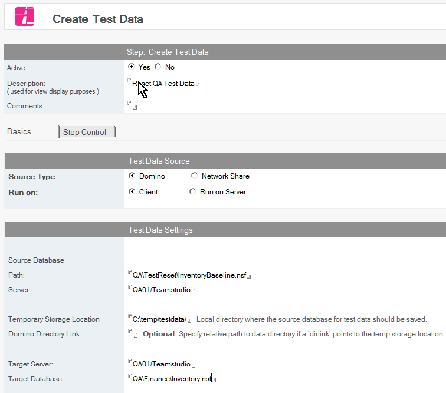

# Create Test Data

Populate your test dest database with a predefined set of documents, ensuring an accurate baseline for testing.

!!! note
    This step is new in Build manager 8.0
    
## Configuring a Test Data Step
1. Select the Promotion path document to which you want to add the Test Data step.
2. Click the *Create* button and choose *Create Test Data*. The Test Data document appears
   
3. In the Test Data document, the Active radio button should be *Yes*. Fill in the Description and any desired comments.
4. Choose *Source Type* to determine where to obtain source documents. For details on Network Share operations, see the note later in this document.
5. Set *Run on* to control where the data copying should occur. Run on *Client* is the preferred mode, as it does not require special server setup (see *Server Setup* below for details). However, *Run on Server* may be used to avoid copying data via the client where large volumes of test data are involved. If *Run on Server* is selected, additional options will appear.
    * *RunOnServer* runs the Test Data creation on the server by a direct call to NotesAgent.runOnServer. The promotion will block entirely, without any status updates, until the copy completes.
    * *Separate Process* will create a new process and run the test data creation on the server, allowing Build Manager to read and update status during the copy. This option is generally more user-friendly, however, the RunOnServer option has less complex interactions and can be used if this option does not work as expected. 
6. Specify the location of the Source database from which to copy test data.  If Domino is chosen as Source Type, this is the server and file path of the database. When using Network Share you can use a Stored Network Share or define the share's connection property here. For details on configuring Network Shares, see the documentation.
7. If copying the source database from a Network Share, specify the *Temporary Storage Location* where the database should be copied locally. Optionally, a *Domino Directory Link* can be specified to open this new database copy as if it were in the data directory.
8. Specify *Target Server* and *Target Database* to indicate the database where test data should be copied/restored.
9. If *Run on Server* is specified, specify the location of Build Manager on the target server in the Target Build Manager field. For *Run on Server*, a copy of Build Manager must exist on the server where the copy will take place, and must be signed with an ID capable of running restricted operations. This Build Manager does not need to be the current Build Manager, and does not require other configuration.
10. Under *Target Preparation* the target database (where test data will be copied/restored) can be prepared by deleting existing documents.  Documents can be deleted by selection formula, or by specifying views that documents appearing in should not be deleted - the later is best for performance on large datasets.
11. Under *Documents to Copy*, specify the documents that should be copied from the source to the target.  Documents will be copied with UNIDs and parent-child relationships preserved.  If a document exists in the target, the source document will overwrite it. \ Documents can be copied by selection formula, or all documents except those that appear in certain views. \ For large datasets, removing documents via the Target Preparation options is more efficient than allowing them to be overwritten.
12. If profile documents should be updated from the source to the target, specify the profile document names under *Copy Profile Documents*.
13. Optionally, specify *Recreate Full Text Index* to ensure that the index is dropped and rebuilt when the copy is completed. Note that this requires the index to have been enabled on the target database prior to the promotion, or the step will fail.

Save and close the document.
The new Create Test Data entry appears under the Build or Promotion Path to which it applies.

## Network Shares
Build Manager can copy the test data source database from a network file share. This option can be useful for preserving clean snapshots of QA data without taking up server space. For details on configuring Network Shares, see the [documentation](srnetwork.md).