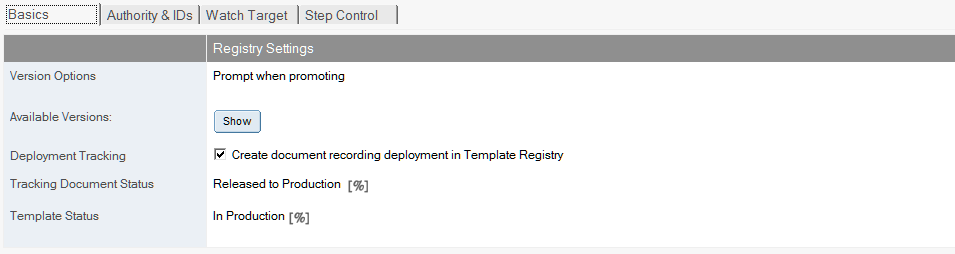
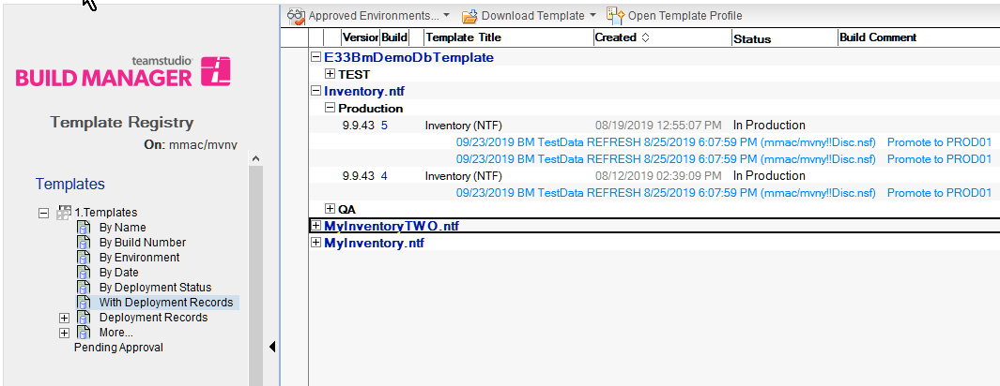
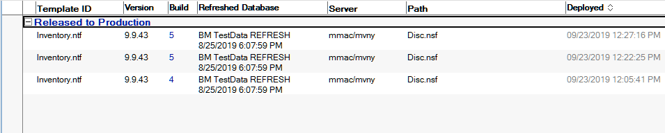

# Tracking Deployments

Build Manager version 8 and later provides two options to track deployment

* **Deployment Tracking** Creates a tracking document as a response document to the Template document for each target database refreshed, including information about how and when the refresh occurred.
* **Deployment Status** Sets a custom status message on the Template document when a promotion has deployed a template.

Each of these options has a specific purpose.

Deployment tracking documents each environment and refresh target where a Template has gone, allowing detailed views and reports to be created giving insight into the current deployment status of a Template, or trends over time.

Deployment status creates a data element in the Template document itself so that views and reports can be created that include information about the status of the template in your environment.  Because the status value is configurable, the status can be set to whatever value makes sense in your environment.

## Configuration
Tracking is configured on the Promotion Path document, and can only be set for Promotions that originate from a Template Registry database.

!!! note
    This feature requires Template Registry version 1.1.8 (included in the Build Manager 8.0 release) or higher.  Failure to update the Template Registry will cause errors during promotion which will persist until the template is upgraded. Proper signing is required for some features, see Signing, below.
    
<figure markdown="1">
  
</figure>

To enable this feature, check the *Deployment Tracking* option on the desired Promotion Path.
*Tracking Document Status* allows you to add a custom status to the per-refreshed-database tracking documents created. Macros can be used. 
*Template Status* allows you to add a status to the main Template document as a result of the promotion. Macros can be used.

Statuses and deployment records are available in Template Registry views.
<figure markdown="1">
  
</figure>

Views only containing deployment records can be organized to highlight specific properties.
<figure markdown="1">
  
</figure>

## Signing and Security
In order to provide adequate security for the Template document in Template Registry, updates during promotions to the main template document are accomplished by calling the Template Registry agent (ProcessStatusUpdate), which must be signed with an ID that has editor rights to the Template Registry, and the ACL Role [AddTemplateEnvironments].

Updating the Template document status is optional, and if no status is specified in the Template Status field, no update will occur.

Enabling Deployment Tracking creates response documents, so the active user (Promotion ID or initiating user) must have ACL Create Document rights in the Template Registry.

Deployment Tracking documents are used to update the Template Status on the Template document. It is not possible to update Template Status unless Deployment Tracking is enabled.