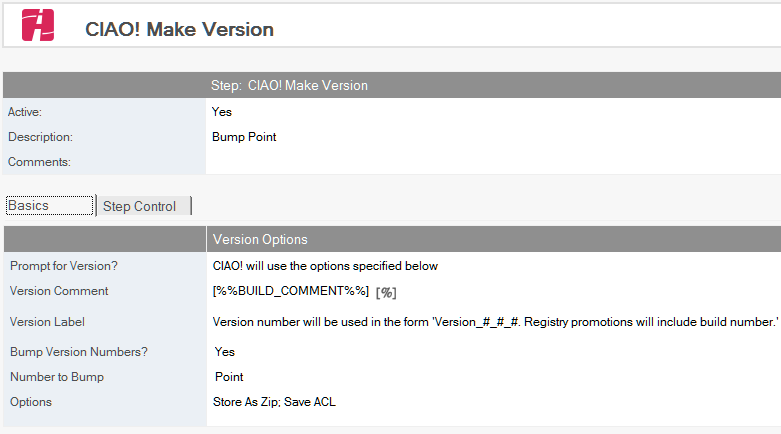
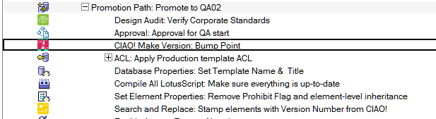

# Make Version with CIAO

Automate CIAO version creation.

!!! note
    This step requires that Teamstudio CIAO is installed on the workstation that is performing the promotion.
    
## To Create a Make Version Step
1. Select the Promotion path document to which you want to add the Make Version step.
2. Click the *Create* button followed by *Make Version*. The Make Version document appears.
   
3. The Make Version document is active by default. Leave this setting.
4. Enter a descriptive name in the *Description* field (for example, Gold Version).
5. Uncheck *Prompt for Version* if you want to promote without user intervention. You need to provide a version comment and label, whether to bump version numbers, and which options to use (Store As Zip,
   Save Documents, Save ACL or Save Replication Settings). Leave this option selected if you want CIAO to prompt you with the Make Version dialog box for each promotion. 
6. Save and close the document. The new Make Version entry appears in the right pane, under the Build or Promotion Path to which it applies. 
<figure markdown="1">
  
</figure>